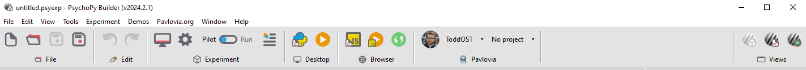

This package is for creating a "ribbon" control in wxPython. A ribbon is like a toolbar, but a bit more advanced - you can add sections and a wider variety of controls. 

Check out the examples in [demos](/demos) to see how to use it, if you run [demos/basic.py](demos/basic.py) it'll create a ribbon which looks like this:

Some default icons are packaged with wx-ribbon, courtesy of [fontawesome.com](https://fontawesome.com/), but you can add your own via [wx_ribbon.icons:RibbonIcon](wx_ribbon/icons/base.py#L17C7-L17C17) - you just need to provide an svg file for the icon in light and dark mode.

This is adapted from code I wrote for [PsychoPy](https://github.com/psychopy/psychopy), whose ribbon looks like this:

