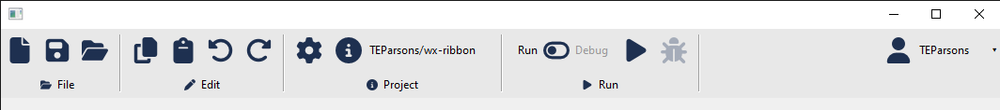

This package is for creating a "ribbon" control in wxPython. A ribbon is like a toolbar, but a bit more advanced - you can add sections and a wider variety of controls. 

Check out the examples in [demos](/demos) to see how to use it, if you run [demos/basic.py](demos/basic.py) it'll create a ribbon which looks like this:
